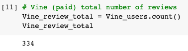
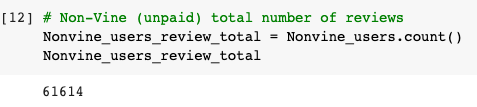
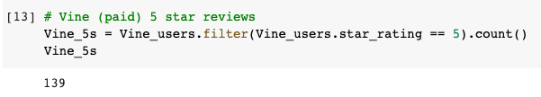
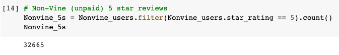
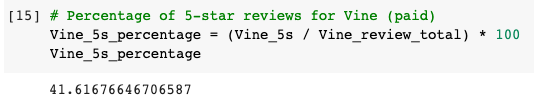
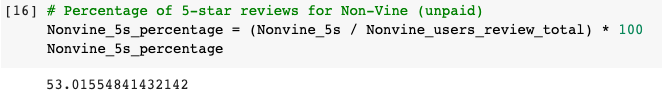

# Amazon_Vine_Analysis

The Amazon Vine program is a service that allows manufacturers and publishers to receive reviews for their products. In this project, we will analyze Amazon Vine program and determines if there is a bias toward favorable reviews from Vine members.

In this project, I have access to approximately 50 datasets. Each one contains reviews of a specific product, from clothing apparel to wireless products. I will be focusing on US reviews for sports items. PySpark will be used to perform the ETL process to extract the dataset, transform the data, connect to an AWS RDS instance, and load the transformed data into pgAdmin. Next, I'll use PySpark to determine if there is any bias toward favorable reviews from Vine members in your dataset.

## Results

### How many Vine reviews and non-Vine reviews were there?

There were 334 Vine reviews. Please see the picture below:

There were 334 Vine reviews. Please see the picture below:

### How many Vine reviews were 5 stars? How many non-Vine reviews were 5 stars?

There were 139 Vine 5 star reviews. Please see the picture below:

There were 32665 Non-Vine 5 star reviews. Please see the picture below:

### What percentage of Vine reviews were 5 stars? What percentage of non-Vine reviews were 5 stars?

The percentage of 5 star Vine reviews is 41.62%. Please see the picture below:

The percentage of 5 star non-Vine reviews is 53.02%. Please see the picture below:

## Summary:

Based on the results, because there are both 40%-55% 5 star reviews within both the Vine and non-Vine programs, we can confirm there is no positivity bias for reviews in the Vine program. As a matter of fact, There is actually a higher percentage of 5 star reviews from the non-Vine users. Use the results of your analysis to support your statement. An additional analysis I would recommend is to calculate the statistical distribution (mean, median and mode) of the star reviews for both the Vine and non-Vine program to determine how similar the results are.
